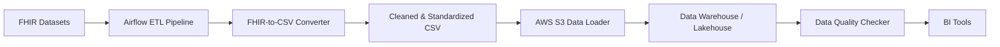

# FHIR ETL Pipeline

**From FHIR data to actionable insights — a complete ETL pipeline for healthcare analytics.**

---

## 📊 Overview
This project demonstrates an end-to-end data engineering pipeline for healthcare datasets using **FHIR (Fast Healthcare Interoperability Resources)**. It covers extraction, transformation, loading, data quality validation, and consumption by BI tools.

The pipeline enforces a clean Git workflow:
- `feature/*` and `fix/*` branches → development work
- `dev` branch → integration branch
- `main` branch → stable production-ready branch

GitHub Actions validate branch naming conventions and enforce that only `dev → main` merges are allowed.

---

## 🏗️ Architecture

## 🔗 How It All Connects
- **FHIR JSON** is extracted and converted into CSV using the converter module.
- **Airflow DAG** orchestrates the pipeline, ensuring tasks run in sequence.
- **CSV files** are loaded into AWS S3 for scalable storage.
- **Warehouse/Lakehouse** ingests the data for structured querying.
- **Data Quality** Checker validates the ingested data against defined rules.
- **BI Tools** consume the validated data to generate dashboards and reports.

## 🎯 Desired Outcome
- Provide a **professional-grade portfolio project** showcasing modern data engineering practices.
- Demonstrate **healthcare-specific ETL expertise** with FHIR datasets.
- Deliver a **stable, production-ready main branch** protected by GitHub Actions and branch rules.
- Enable **BI teams and analysts** to derive actionable insights from clean, validated healthcare data.
- Serve as a **template project** for future ETL pipelines in regulated industries.