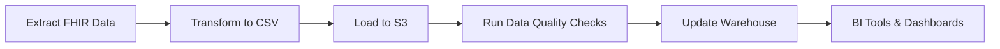

# Architecture

The FHIR ETL Pipeline consists of:
- **Airflow DAGs** orchestrating ETL tasks.
- **FHIR-to-CSV Converter** flattening JSON bundles.
- **AWS S3 Loader** storing data in cloud buckets.
- **Warehouse schema** defining relational tables.
- **Data Quality Checker** validating ingested data.
- **BI Tools** consuming validated datasets.

**Data Flow: FHIR → CSV → S3 → Warehouse → DQ → BI**

---

## Airflow DAG Flow

